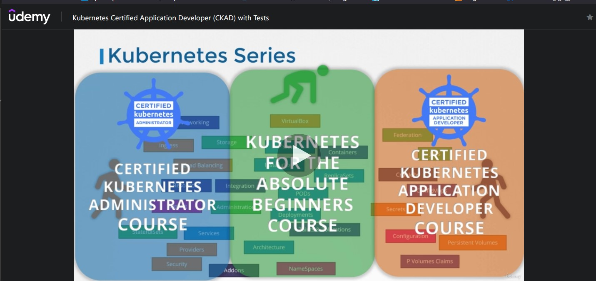
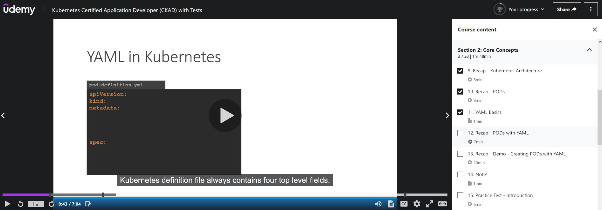
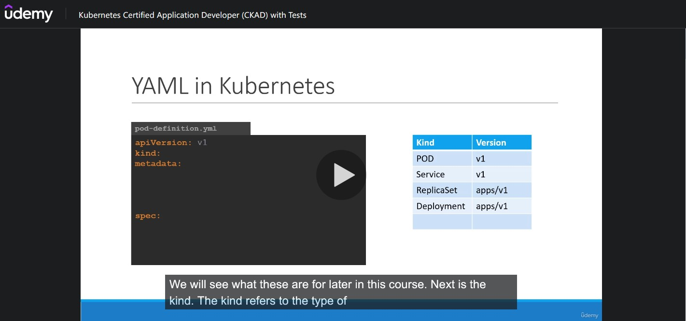
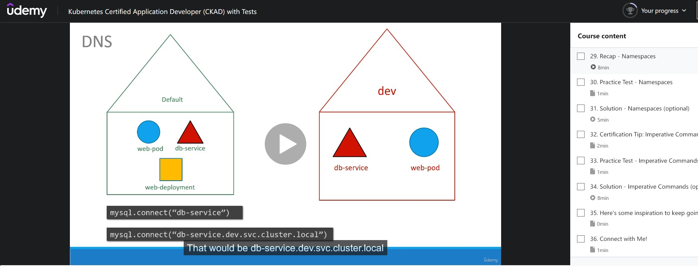
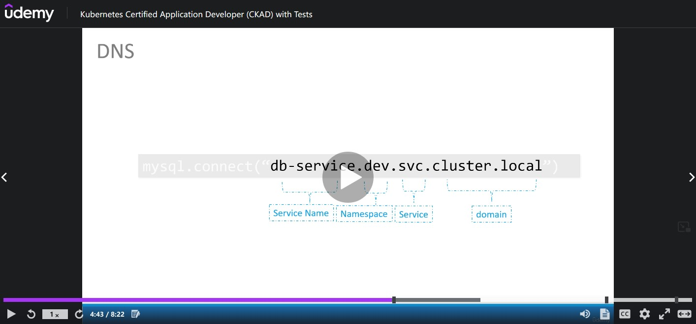
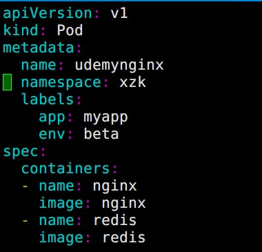
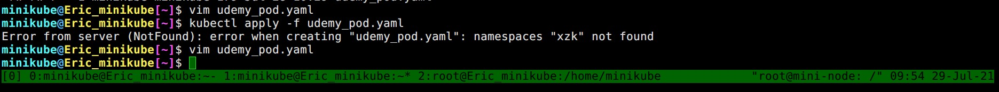
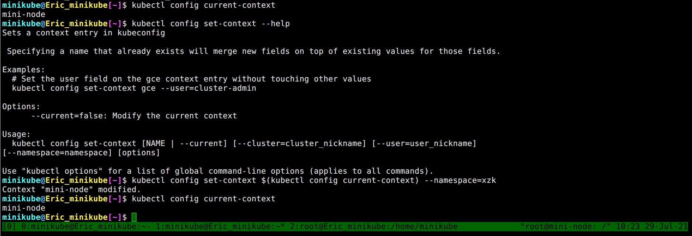

# CKAD Note Section 1 Introduction

<br>

## Kubernetes Series

<br>

作者的系列課程總共有三個，分別適合不同職位的三種人。

- Absolute Beginners (零經驗初學者，帶你從 container 開始)
- sysAdmin (想要通過 CKAD)
- Application Developer (程式開發人員)

<br>



<br>

---

## Certification Details

<br>

這邊告知 CKAD 考試的方式 (非選擇題、線上考試、會有監考官、考試時間 2 小時)


[CNCF-Certified Kubernetes Application Developer (CKAD)](https://www.cncf.io/certification/ckad/)


[Linux Foundation-Frequently Asked Questions: CKA and CKAD & CKS](https://docs.linuxfoundation.org/tc-docs/certification/faq-cka-ckad-cks)


[線上考試需求](https://docs.linuxfoundation.org/tc-docs/certification/faq-cka-ckad-cks#what-are-the-system-requirements-to-take-the-exam)


```
Certified Kubernetes Application Developer: https://www.cncf.io/certification/ckad/

Candidate Handbook: https://www.cncf.io/certification/candidate-handbook

Exam Tips: https://www2.thelinuxfoundation.org/ckad-tips


Keep the code - DEVOPS15 - handy while registering for the CKA or CKAD exams at Linux Foundation to get a 15% discount. 
```

---

### CNCF Taiwan User Group 發文

Certified Kubernetes Application Developer (CKAD) 要改版了嗎?
官方公告新的 CKAD-2021 將在今年 Q3 實施 (最少會提早 30 天在網站上公告)

目前考試項目與註冊頁面: https://training.linuxfoundation.org/certification/certified-kubernetes-application-developer-ckad/
公告實施頁面: https://training.linuxfoundation.org/ckad-program-change-2021/
7 月 SYSADMIN Day 折扣 (-100 USD): https://training.linuxfoundation.org/july-2021-promo/

<br>

---

# Section 2 Core Concepts

<br>

K8s yaml 檔永遠有四個 top 欄位 (top level of field): **<span style='color:blue'>apiVersion, kind, metadata, spec</span>**




<br>

不同的 kind 使用的 `apiVersion` 也不同




<br>

`spec.containers` 之所以是 list/array 型態是因為一個 `pod` 可以包含多個 container


<br>


### 20.Edit Pods


**<span style="color:blue">如果遇到題目要求修改現有 Pod 的話</span>**


```bash
kubectl get pods my-app -o yaml > edit_this.yaml
kubectl delete pods my-app
kubectl apply -f edit_this.yaml
```


**<span style='color:red'>Tips 快速刪除</span>**


如果不使用內建的 `--now` 或者 `--force --grace-period=0` 刪除 K8s resource 的話，等待時間將會拖很久。 有些物件 (例如: `pod`) Kubernetes 預設會等一會兒材會刪除 (grace period) ，在考照的時候你不會想等的!

<br>

```bash
## delete resource SUPER fast!
kubectl delete pod my-nginx-76c845b9fc-fmnmh --force --grace-period=0

## export
export now='--force --grace-period=0'

## use var
kubectl delete deployments.apps nginx-rollout $now

## delete now
kubectl delete deployments.apps nginx-rollout --now
```


或者直接使用 `kubectl edit` 修改


```bash
kubectl edit pod <pod-name>
```

<br>

### (Recap) 21. ReplicaSets


要縮放 pods 可以使用指令


```bash
kubectl scale --replicas=4 replicationcontroller my-first-rc

## also, but won't update the yaml file
kubectl scale --replicas=9 -f replica-controller.yml
```


(自己另外補充的) `kubectl create` 與 `kubectl apply` 差異


> kubectl create = Creates a new k8s resource in the cluster\
> kubectl replace = Updates a resource in the live cluster\
> kubectl apply = If I want to do create + replace


[kubectl apply vs kubectl create?](https://stackoverflow.com/questions/47369351/kubectl-apply-vs-kubectl-create)


<br>

### (Recap) 29.Namespaces

<br>

每個 `namespace` 擁有各自的成員與資源 (resources)，Kubernetes 會自動建立一系列的 `pods` 與 `service` 作為內部服務，例如 Networking 或者 DNS service


**<span style='color:red'>不同 `namespace` 可以互相存取</span>**




<br>




<br>


在 `YAML` 裡面也可以直接定義這個 Kubernetes 元件必須被建立在哪個 `namespace` 裡面，這樣就不用怕忘記下指令時忘記 `--namespace=`\
如果 `YAML` 裡面指定的 `namespace` 不存在，則會出現錯誤




<br>



▲ 當 `namespace` 不存在時出現錯誤

<br>

要建立 `namespace` 可以透過 `YAML` 或者 **<span style='color:blue'>簡單一點透過 `kubectl create namespace xzk` 達成</span>**


```yaml
apiVersion: v1
kind: Namespace
metadata:
  name: xzk
```

<br>

假如我們必須要在 `xzk` 這個 `namespace` 下面工作許久，不想要每次都 `--namespace=xzk` 的話可以透過


```bash
kubectl config set-context $(kubectl config current-context) --namespace=xzk

## prefer this one
kubectl config set-context --current --namespace=xzk
```




<br>

---

### 利用 `--dry-run` 快速產生 YAML File (32. Certification Tip: Imperative Commands)

<br>

`--dry-run` 預設是帶 `--dry-run=none`，使用者也可以自訂要使用 `--dry-run=client` 或者 `--dry-run=server`。\
如果目的是快速產生 `YAML` file 來說最簡單的方式是不帶 (`--dry-run`)


**產生 pod**


```bash
kubectl run nginx --image=nginx --dry-run -o yaml > nginx.yml
```


```yaml
apiVersion: v1
kind: Pod
metadata:
  creationTimestamp: null
  labels:
    run: nginx
  name: nginx
spec:
  containers:
  - image: nginx
    name: nginx
    resources: {}
  dnsPolicy: ClusterFirst
  restartPolicy: Always
status: {}
```


**產生 Deployment**


```bash
kubectl create deployment nginx --image=nginx --dry-run -o yaml
kubectl create deployment nginx --image=nginx --replicas=4 --dry-run -o yaml
```


```yaml
apiVersion: apps/v1
kind: Deployment
metadata:
  creationTimestamp: null
  labels:
    app: nginx
  name: nginx
spec:
  replicas: 1
  selector:
    matchLabels:
      app: nginx
  strategy: {}
  template:
    metadata:
      creationTimestamp: null
      labels:
        app: nginx
    spec:
      containers:
      - image: nginx
        name: nginx
        resources: {}
status: {}
```